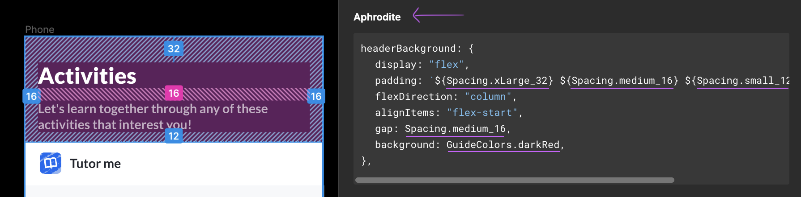
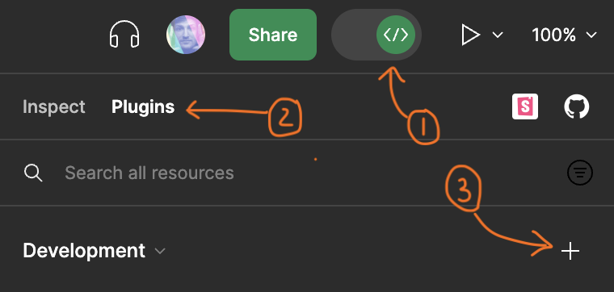

# Figma Dev Mode exporting to Aphrodite (styling engine)

This Figma plugin was made to streamline front end styling work, with quick copy-paste for Aphrodite. It can also be customized to connect Figma variables to your own codebase's styling values (color, size, position... etc.) It functions in `Dev Mode,` replacing the default CSS output with an Aphrodite object. 

## Installation

To install the plugin:
- Enter Dev Mode
- Click the Plugins tab
- Hit the plus button
- Figma will prompt you to find the manifest file: `dist/manifest.json` 

To get your edits running:
- `npm run bundleup`
- `npm run watch`
